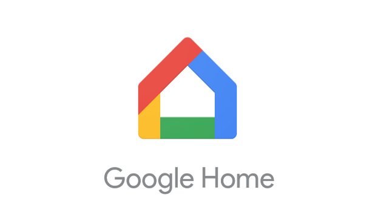

# Général


Utilisation du ChromeCast peut différer selon l'appareil utiliser. Il est donc important de repérer le type et modèle de votre appareil avant de continuer.


## Wifi

Vous devez d'abord vous connecter au wifi Station900. Demandez le mot de passe à la réception ou regarder sur la fiche derrière le Téléviseur.

## Navigateur Google Chrome

Pour être en mesure de caster, vous devez avoir installé l'application [GoogleChrome](https://www.google.com/chrome/) \(GoogleChrome est un navigateur qui peut remplacer Safari ou Internet Explorer\).

## Application Google Home

Sur mobile, vous pouvez télécharger l'application GoogleHome pour aider l'utilisation du ChromeCast.

* GoogleHome [Iphone et Ipad](https://itunes.apple.com/app/google-home/id680819774)
* GoogleHome [Androïd](https://play.google.com/store/apps/details?id=com.android.chrome&pcampaignid=thankyoupage)

