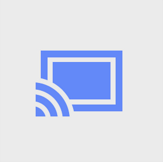

# Iphone et Ipad


N'oublier pas de télécharger l'application Google Home sur votre appareil mobile.

* Pour Iphone sur [App Store](https://itunes.apple.com/app/google-home/id680819774).
* Pour Android sur [Google Play](https://play.google.com/store/apps/details?id=com.google.android.apps.chromecast.app).



Pour caster avec un appareil mobile vous devez utiliser des appareils intégrer avec Google ChromeCast. Voir la liste des applications compatible [ici](https://store.google.com/ca/product/chromecast_2015_apps?hl=fr-CA).


1. Ouvrez une application compatible Google Cast sur votre appareil.
2. Trouvez une vidéo ou autre contenu à regarder.
3. Touchez l'icône Cast à partir d'une application compatible.

 4. Contrôlez-le directement à partir de votre appareil.

