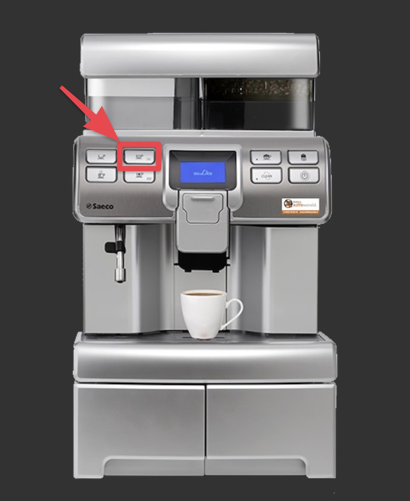
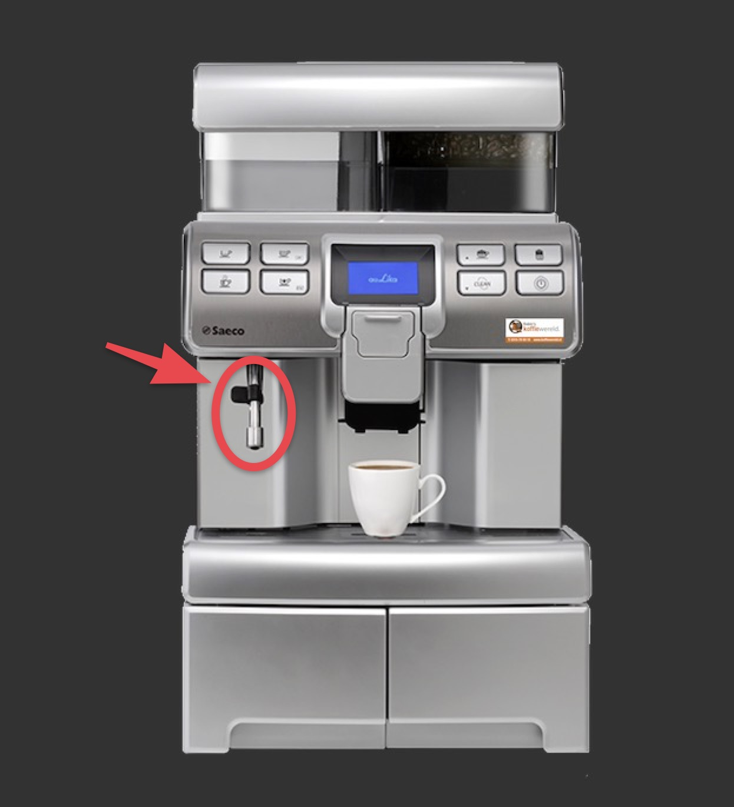

# Régulier \(Méthode 2\)

## Pour faire un café régulier \(Méthode 2\)


 La méthode 2 est utiliser  qui désirent un café plus chaud


1. Appuyer sur le 2ie bouton Expresso

2. Une fois terminer, placer votre tasse sous la tige métallique

3. Ajouter de l'eau chaude jusqu'à temps vous ayez atteint la quantité désiré

4. Fin

