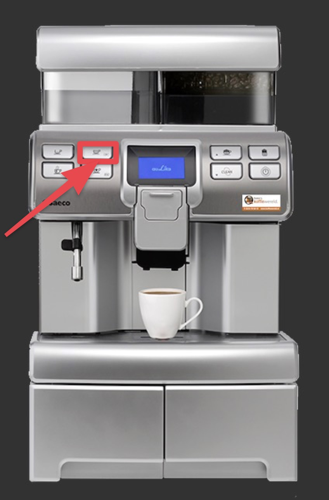

# Régulier \(Méthode 1\)

## Pour faire un café régulier \(Méthode 1\)

1. Appuyer le bouton ‘’ESC’’ pour choisir le type de café

2. Utiliser les flèches pour monter et descendre dans la liste d’option


Choisir Americano pour café standard


3. Appuyer sur l’option ‘’OK’’ lorsque le café est choisi.

4. Ajouter lait, sucre au besoin et savourer !

