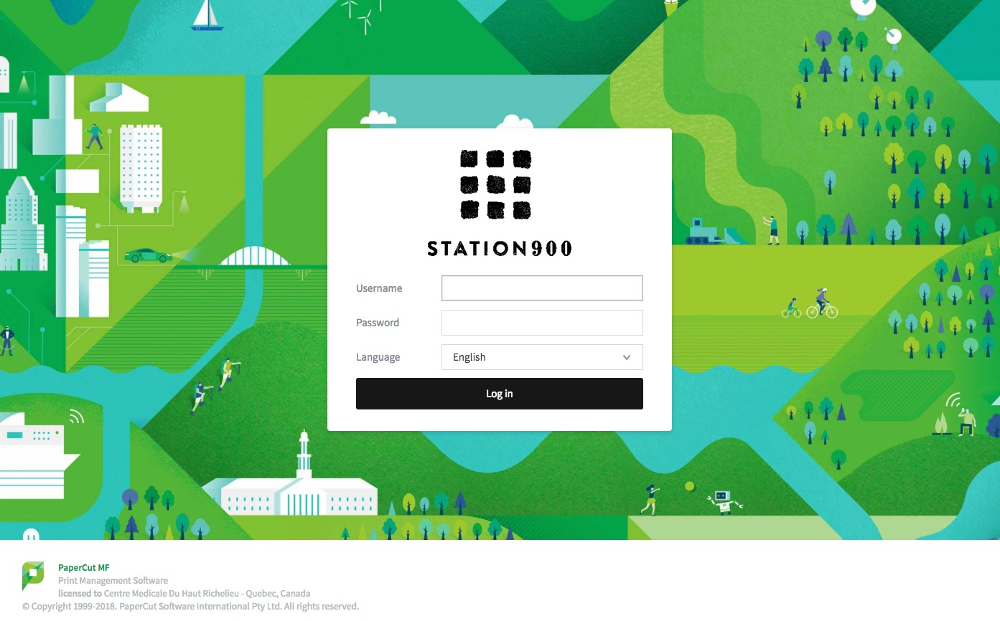
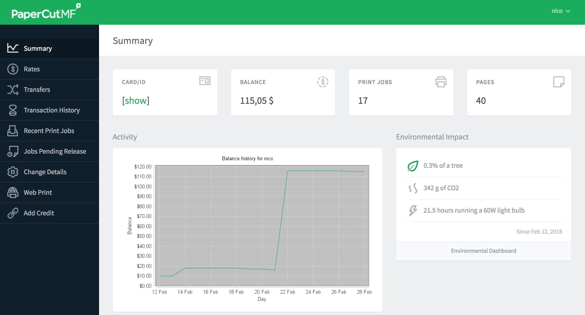

# Procédures Imprimante

## Se connecter a son compte : {#se-connecter-a-son-compte}

1. Demander votre _username_ et _password_ spécifique à l’imprimante \(voir la réception\)
2. Accéder au lien suivant

   [http://cmhr.dyndns.org:8085/](http://cmhr.dyndns.org:8085/)

et entrer votre _username_ et _password_

* Bienvenue dans la Tableau de bord de l’imprimante

  

