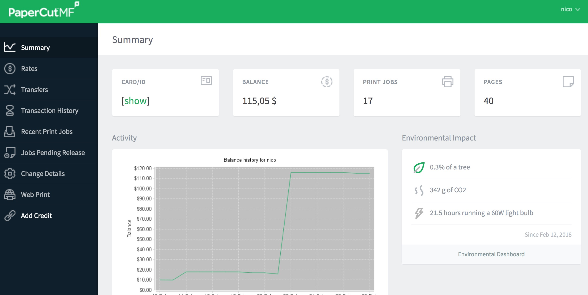
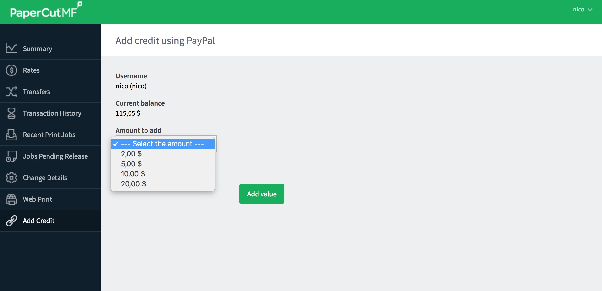
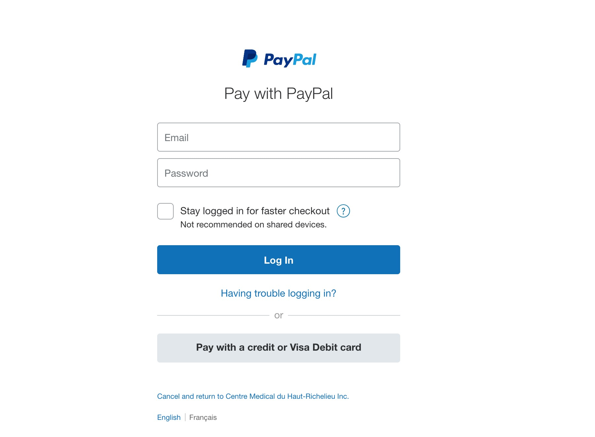
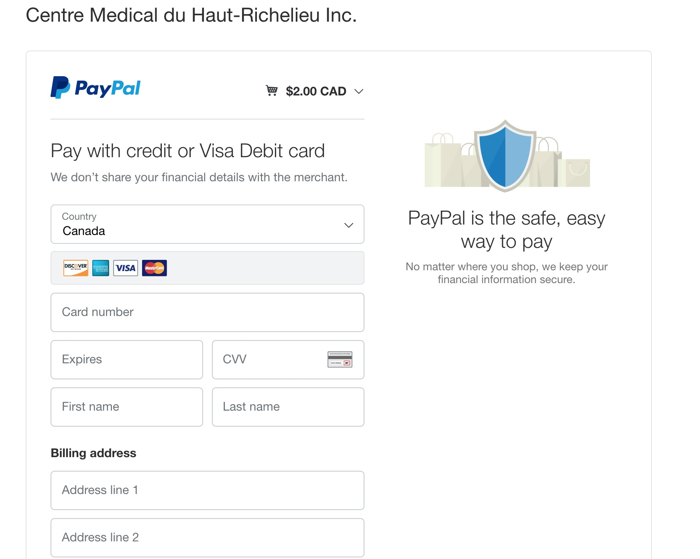

# Ajouter des Crédits

1. À partir du tableau de bord, sélectionner:

   _Add Credit_

    dans le menu de gauche.

   

2. Sélection le montant que vous voulez ajouter à votre compte.

   

3. Ensuite, click sur _Add value_ et vous serez redirigé vers le compte PayPal associer à la Station 900 et du Centre Médical du Haut-Richelieu \(CMHR\).

3.1 Si vous avez déjà un compte PayPal vous pouvez entré votre

_courriel_ et _password_

 comme vous le faîte pour d’autres achats avec PayPal.

Si vous n’avez pas de compte, vous pouvez seulement entrer vos informations de paiement 

\(_Pay with credit or Visa Debit card_\)

* Après avoir finaliser la transaction vous serez redirigez vers votre compte PaperCut de la Station 900 \(comme la capture d’écran au point 2\)
* Fin


**À noter:** Si les crédits achetés n’apparaissent pas à votre compte, seulement vous déconnecter de votre compte et vous reconnectez. Si le problème persiste, rendez-vous à la réception.


